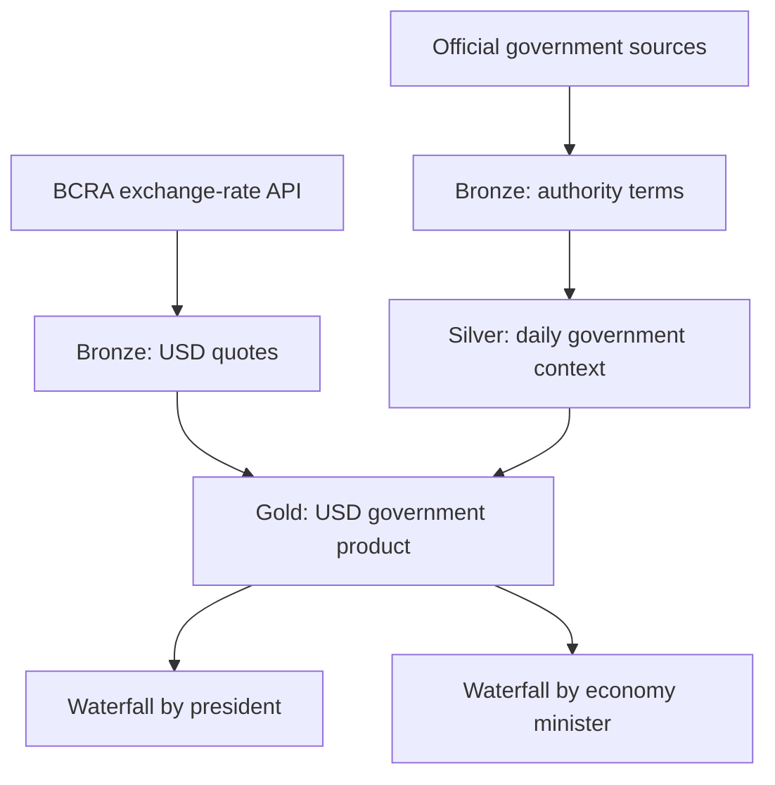
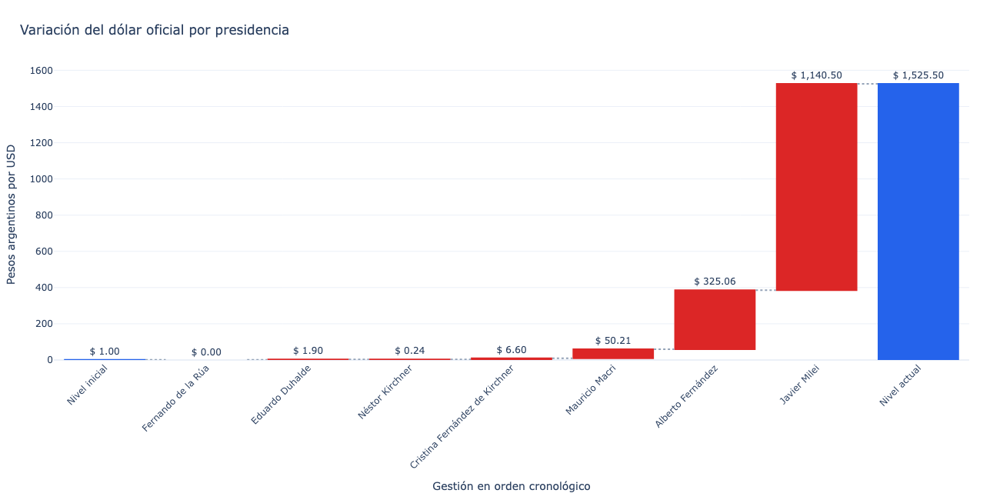
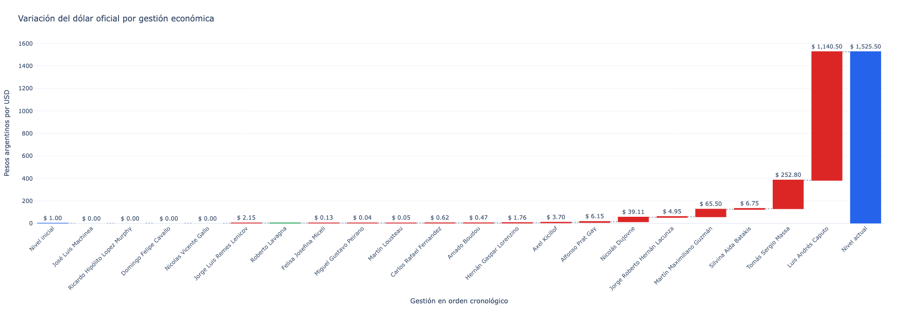

# Argentine USD Government Data Product

[](https://colab.research.google.com/github/renzungo/arg-kpi-usd-data-product/blob/main/notebooks/01_Arg_KPI_USD.ipynb)
[](https://colab.research.google.com/github/renzungo/arg-kpi-usd-data-product/blob/main/notebooks/02_Arg_KPI_Government.ipynb)
[](https://colab.research.google.com/github/renzungo/arg-kpi-usd-data-product/blob/main/notebooks/03_Arg_KPI_USD_Government_Product.ipynb)

An end-to-end data engineering project that combines Argentina's official USD exchange-rate history with presidential administrations and Ministers of Economy. The pipeline uses Python, Delta Lake, MinIO, and a Bronze–Silver–Gold architecture to produce analytics-ready datasets and two waterfall charts.

> **Analytical disclaimer:** the visualizations show how the official USD exchange rate changed during each administration. This is temporal attribution, not evidence that a president or minister was the sole cause of the variation.

## Project objective

This project was developed as part of a Data Engineering course. Its primary objective is to demonstrate the complete data lifecycle:

- extracting data from official and heterogeneous sources;
- handling pagination, retries, temporary source failures, and historical backfills;
- standardizing schemas, dates, and data types;
- storing versioned datasets as Delta tables in MinIO;
- implementing idempotent incremental loads;
- applying data-quality controls and reconciliation rules;
- publishing a reusable Gold-layer data product;
- consuming that product through interactive waterfall charts.

The economic subject provides a relevant real-world use case, but the main focus of the repository is the engineering process and the design decisions behind it.

## Architecture



### Medallion layers

| Layer | Dataset | Grain | Purpose |
|---|---|---|---|
| Bronze | `currencies` | One row per currency | BCRA currency master data |
| Bronze | `usd_quotes` | One row per available quote date | Historical official USD exchange rate |
| Bronze | `presidential_terms` | One row per presidential term | Normalized presidential periods |
| Bronze | `economy_minister_terms` | One row per ministerial term | Normalized economic-authority periods |
| Silver | `government_context_daily` | One row per calendar date | Daily president and economy-minister context |
| Gold | `usd_government_daily` | One row per USD quote date | Integrated analytical fact table |
| Gold | `usd_variation_by_president` | One row per president | Input for the presidential waterfall |
| Gold | `usd_variation_by_economy_minister` | One row per minister | Input for the ministerial waterfall |

## Data sources

### BCRA exchange-rate API

- Provider: Banco Central de la República Argentina
- API documentation: <https://www.bcra.gob.ar/documentacion-apis/?fileName=estadisticascambiarias-v1>
- Currency master endpoint: `/Maestros/Divisas`
- USD history endpoint: `/Cotizaciones/USD`
- Authentication: not required

### Government context

- Ministers of Economy: <https://cdi.mecon.gob.ar/ministros-de-economia>
- Presidents and government authorities: <https://www.argentina.gob.ar/defensa/nomina-de-presidentes-y-ministros>

The ministerial CSV is used as the primary online source. Because the official website can be temporarily unavailable, the corresponding notebook contains an official fallback snapshot for pipeline resilience.

## Repository structure

```text
arg-kpi-usd-data-product/
├── notebooks/
│   ├── 01_Arg_KPI_USD.ipynb
│   ├── 02_Arg_KPI_Government.ipynb
│   └── 03_Arg_KPI_USD_Government_Product.ipynb
├── images/
│   ├── waterfall_by_president.png
│   └── waterfall_by_economy_minister.png
├── README.md
├── requirements.txt
├── .gitignore
└── LICENSE
```

## Notebook execution order

Run the notebooks in the following order:

```text
01_Arg_KPI_USD
        ↓
02_Arg_KPI_Government
        ↓
03_Arg_KPI_USD_Government_Product
```

### 1. USD pipeline

`01_Arg_KPI_USD.ipynb`:

- extracts the BCRA currency master and USD exchange-rate history;
- uses metadata-based pagination with `limit` and `offset`;
- repairs incomplete historical loads through an automatic backfill;
- calculates the current date using the Buenos Aires time zone;
- performs an idempotent Delta Lake `MERGE` by date;
- stores the resulting Bronze tables in MinIO;
- runs validation and Delta Lake maintenance operations.

### 2. Government-context pipeline

`02_Arg_KPI_Government.ipynb`:

- extracts and normalizes presidential and ministerial periods;
- supports mixed date formats and source encoding differences;
- includes the provisional presidents from the 2001 institutional crisis;
- transforms term intervals into a daily government dimension;
- stores normalized periods in Bronze and daily context in Silver;
- uses an embedded fallback when the official ministerial source is unavailable.

### 3. Gold data product

`03_Arg_KPI_USD_Government_Product.ipynb`:

- reads the USD and government Delta tables;
- validates the upstream data contracts;
- joins both products by date;
- calculates the change from the previous available USD quote;
- attributes each daily change to the authority in office on that date;
- aggregates the changes by president and Minister of Economy;
- reconciles every aggregate with the initial and latest exchange-rate levels;
- publishes three Gold tables and creates two interactive waterfall charts.

## Attribution methodology

For each available BCRA quote date:

```text
daily_change_ars = current_exchange_rate - previous_exchange_rate
```

That change is assigned to the president and economy minister in office on the date of the new quote.

The waterfall identity is:

```text
initial exchange rate
+ sum of administration contributions
= latest available exchange rate
```

The charts use absolute ARS variations because percentage changes across consecutive periods are multiplicative and cannot be added directly.

If a quote follows a weekend or holiday, the accumulated change since the previous available quote is assigned to the authority in office on the new quote date.

## Data-quality controls

The notebooks include checks for:

- required columns and expected schemas;
- empty API responses;
- invalid or missing dates;
- duplicate natural keys;
- null and non-positive exchange rates;
- incomplete historical coverage;
- USD observations without an assigned president or minister;
- invalid or overlapping authority intervals;
- one-to-one join cardinality;
- exact reconciliation between daily changes and the latest USD level.

The pipeline stops before publication when a critical rule fails.

## Engineering challenges addressed

- An API can return fewer records than the requested page limit while additional pages still exist. Pagination therefore uses `metadata.resultset.count` and advances the offset by the requested limit.
- An incremental watermark based only on `MAX(date)` cannot detect missing historical periods. The pipeline also checks `MIN(date)` and performs a historical backfill when required.
- A cloud runtime operating in UTC can be one calendar day ahead of Argentina. The BCRA request date is calculated with `America/Argentina/Buenos_Aires`.
- Official websites can be temporarily unavailable. The government pipeline includes retries and an official fallback snapshot.
- Repeated executions must not create duplicate records. USD loads use a Delta Lake `MERGE` keyed by date.

## Requirements

```text
pandas
requests
pyarrow
deltalake
plotly
kaleido
```

Install the dependencies with:

```bash
pip install -r requirements.txt
```

The notebooks also contain installation cells for Google Colab.

## MinIO configuration

The BCRA API is public and does not require an API token. Credentials are required only for MinIO.

The notebooks expect the following values:

```text
MINIO_ENDPOINT
MINIO_ACCESS_KEY
MINIO_SECRET_KEY
MINIO_BUCKET
```

Do not commit real credentials, IP addresses, `.env` files, or exported notebook outputs containing secrets.

### Google Colab Secrets

Create the four secrets in Colab and authorize notebook access. Then run this initialization cell before the configuration cell in each notebook:

```python
import os
from google.colab import userdata

os.environ["MINIO_ENDPOINT"] = userdata.get("MINIO_ENDPOINT")
os.environ["MINIO_ACCESS_KEY"] = userdata.get("MINIO_ACCESS_KEY")
os.environ["MINIO_SECRET_KEY"] = userdata.get("MINIO_SECRET_KEY")
os.environ["MINIO_BUCKET"] = userdata.get("MINIO_BUCKET")
```

Alternatively, the notebooks request missing values interactively. Secret values are entered with `getpass` so they are not displayed on screen.

## Running the project in Google Colab

1. Open the first notebook using its **Open in Colab** badge.
2. Configure the MinIO secrets.
3. Run all cells in `01_Arg_KPI_USD.ipynb`.
4. Confirm that the USD history begins in January 2000.
5. Run all cells in `02_Arg_KPI_Government.ipynb`.
6. Confirm that the government dimension covers the complete date range.
7. Run all cells in `03_Arg_KPI_USD_Government_Product.ipynb`.
8. Review the reconciliation metrics and both waterfall charts.

## Results

### USD variation by president



### USD variation by Minister of Economy



Increases are displayed in red, decreases in green, and the initial/latest levels in blue.

## Exporting the charts

The third notebook creates the figures with these variable names:

- `president_waterfall`
- `minister_waterfall`

After both charts have been generated, install Kaleido and export them:

```python
%pip install -q kaleido
```

```python
president_waterfall.write_image(
    "/content/waterfall_by_president.png",
    width=1600,
    height=900,
    scale=2,
)

minister_waterfall.write_image(
    "/content/waterfall_by_economy_minister.png",
    width=2000,
    height=900,
    scale=2,
)
```

Download the files from Colab and upload them to the repository's `images/` directory.

If Kaleido reports that Chrome is missing, install it once in the current runtime:

```bash
plotly_get_chrome -y
```

## Saving Colab changes to GitHub

After modifying a notebook:

1. Select **File → Save a copy in GitHub**.
2. Choose `renzungo/arg-kpi-usd-data-product`.
3. Keep the corresponding path inside `notebooks/`.
4. Enter a descriptive commit message.
5. Save the commit.

Example commit messages:

```text
Fix BCRA historical pagination
Add automatic historical backfill
Fix Buenos Aires timezone handling
Add government-source fallback
Create Gold data product
Export waterfall visualizations
```

Before starting a new editing session, reopen the latest GitHub version in Colab to avoid working from an outdated browser copy.

## Security

The repository should include this `.gitignore`:

```gitignore
.env
.env.*
credentials.json
secrets.json
__pycache__/
.ipynb_checkpoints/
.DS_Store
```

Before publishing, search the repository for:

```text
AWS_ACCESS_KEY_ID
AWS_SECRET_ACCESS_KEY
BEARER
TOKEN
PASSWORD
31.97.
```

If a real credential was ever committed, removing it from the latest version is not sufficient because it remains in Git history. Rotate the credential before making the repository public.

## Known limitations

- The project analyzes the official USD series selected from the BCRA API; it does not compare official, MEP, CCL, or informal exchange rates.
- Government attribution is based on calendar validity periods, while exchange-rate observations are available only on BCRA publication dates.
- The waterfall charts describe changes during each administration and must not be interpreted as causal economic evidence.
- The official government source can change its format or availability, requiring source-contract maintenance.
- MinIO is required to reproduce the complete persisted pipeline as currently designed.

## Future improvements

- add automated unit and integration tests;
- orchestrate the notebooks with a scheduler;
- add a pipeline-audit Delta table;
- implement CI checks for notebook syntax and credential leakage;
- compare official USD movements with inflation and other macroeconomic indicators;
- publish a Power BI, Tableau, or Streamlit dashboard;
- package shared functions into reusable Python modules;
- add data lineage and freshness monitoring.

## Author

**Renzo Gutierrez**

- LinkedIn: <https://www.linkedin.com/in/renzo-gutierrez-278018137>
- GitHub: <https://github.com/renzungo>

## License

This project is available under the MIT License. See `LICENSE` for details.

